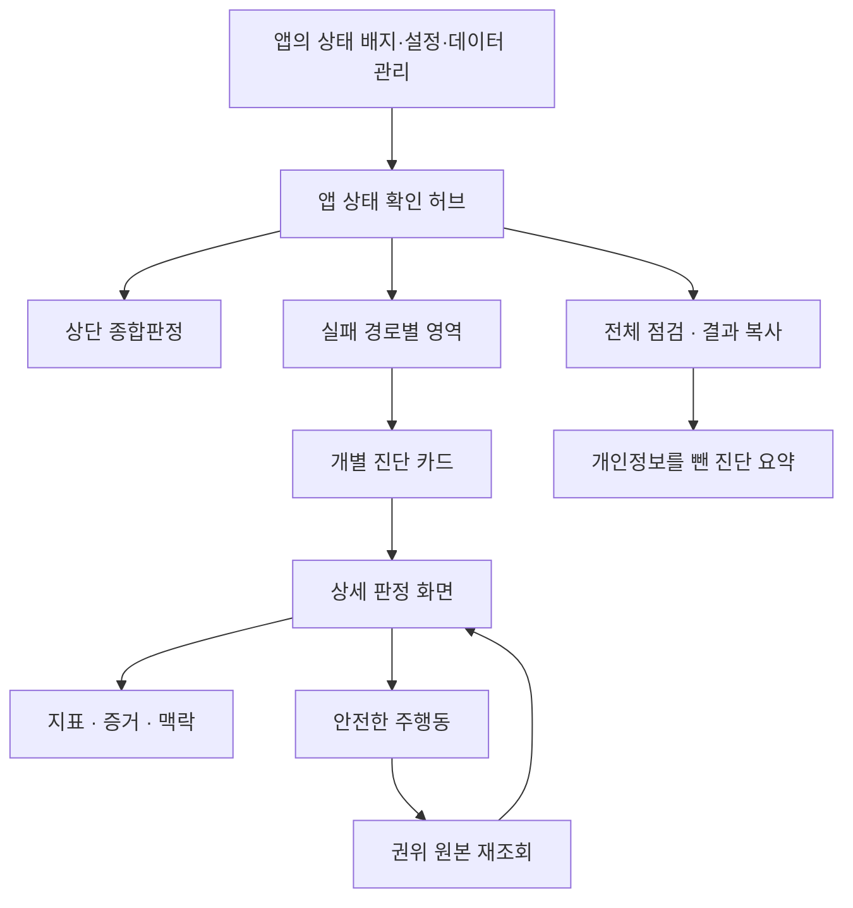
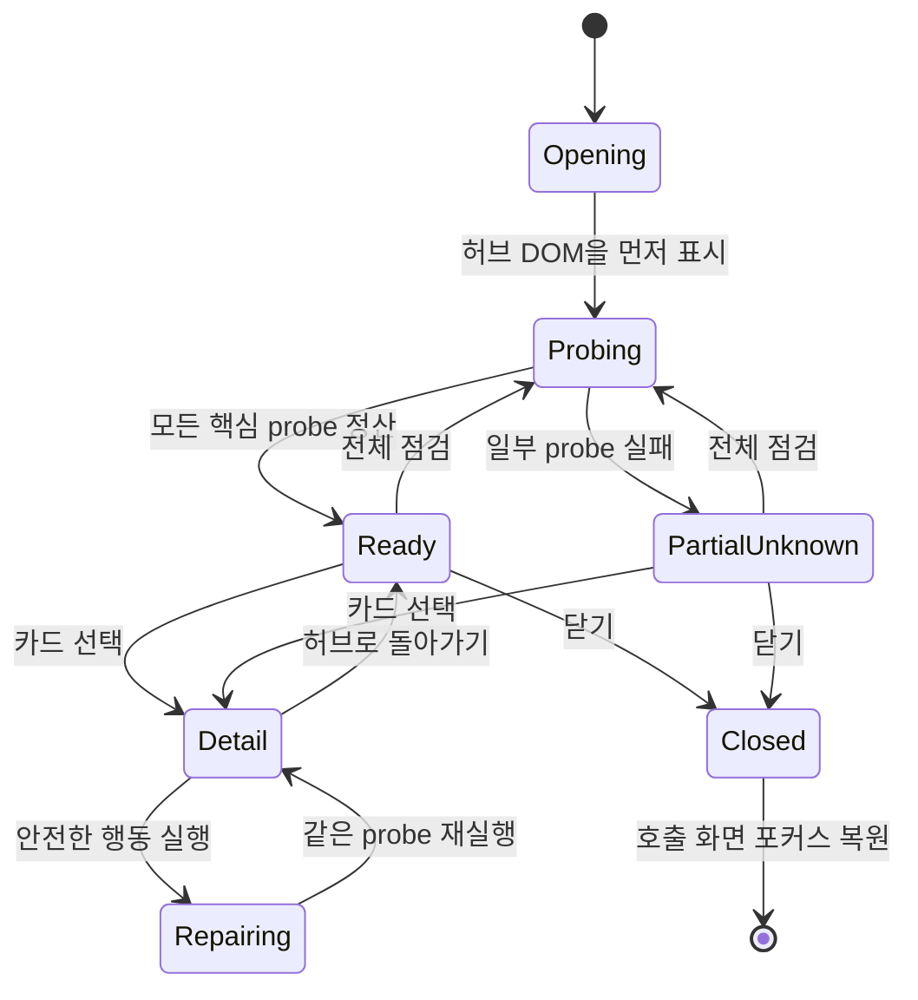
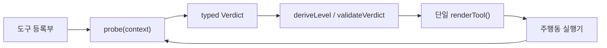
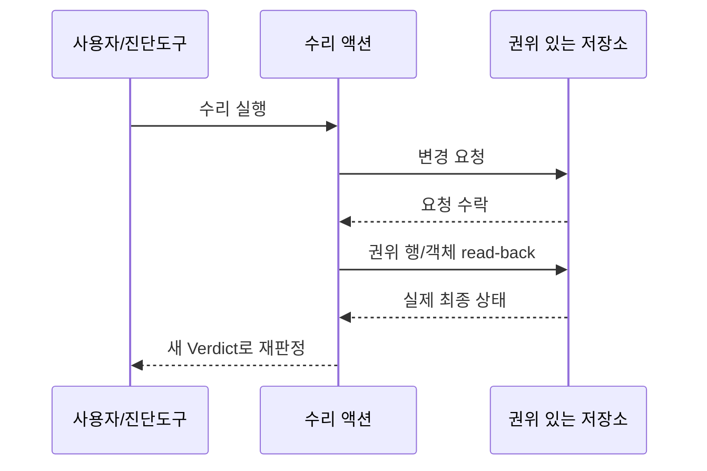

# ‘앱 상태 확인’ 전체 진단 시스템 이식 청사진

> 문서 버전: 1.0<br>
> 대상: 웹·모바일·데스크톱·서버 앱의 운영/사용자 진단 화면<br>
> 목적: 상단 종합판정부터 영역별 도구, 상세 판정, 수리·재검사, 결과 공유, 자동 검증까지 사진과 같은 **전체 진단 시스템**을 다른 앱에서도 재현한다.

## 1. 한 문장 계약

> 진단도구는 원자료를 나열하는 화면이 아니라, **기대 상태와 현재 상태를 증거로 비교해 판정하고**, 안전한 후속 행동을 제시하며, 행동 뒤에는 권위 있는 원본을 다시 읽어 결과를 확인하는 시스템이다.

이 문서의 핵심은 UI 모양이 아니라 다음 네 계약이다.

1. **판정 계약** — 정상·조치 필요·문제·확인 불가를 같은 의미로 사용한다.
2. **증거 계약** — 성공 응답이나 사라지는 임시 상태가 아니라 권위 있는 원본으로 결론을 낸다.
3. **행동 계약** — 수리 동작은 안전 조건을 증명한 경우에만 제공하고, 실행 뒤 재판정한다.
4. **검증 계약** — 알려진 실패를 주입해 RED를 확인한 뒤에만 게이트를 신뢰한다.

## 2. 진단도구가 답해야 하는 질문

좋은 진단도구는 사용자가 화면을 열자마자 다음을 알게 한다.

- 정상은 어떤 상태인가?
- 지금 상태는 정상과 무엇이 다른가?
- 그 결론은 어떤 증거에서 나왔는가?
- 앱이 모르는 부분은 무엇이며 왜 모르는가?
- 지금 할 수 있는 가장 안전한 행동은 무엇인가?
- 그 행동이 실제로 효과가 있었는지 어떻게 확인했는가?

반대로 숫자, 로그, JSON을 그대로 나열하고 사용자가 의미를 추론하게 하면 그것은 진단도구가 아니라 관측 자료 창이다.

### 2.1 이 문서가 말하는 “전체”의 범위

이식 대상은 개별 카드 몇 개가 아니라 다음 화면과 실행 구조 전체다.



포함 범위:

- 모달/전체 화면 셸, 제목, 설명, 닫기, 뒤로 가기, 포커스 복원
- 열자마자 실행되는 종합판정과 카드별 상태 배지
- 전체 재점검과 개인정보를 뺀 결과 복사
- 로컬부터 검증 체계까지 이어지는 경로형 정보구조
- 모든 개별 도구의 등록·실행·판정·상세 렌더
- 읽기 전용 진단, 안전한 수리, 통제된 왕복검사
- 알려진 사각지대의 표시와 추적
- 단위·구조·라이브·운영 read-back 검증

제외 범위는 앱의 일반 설정, 데이터 편집 화면, 운영자 전용 DB 콘솔이다. 진단 허브는 이 기능들을 복제하지 않고 필요한 곳으로 안전하게 연결한다.

### 2.2 사용자가 보는 화면 계약

허브의 세로 순서는 고정된 의미를 가진다.

1. **제목과 범위** — “이 기기에서 지금 무슨 일이 벌어지는지 본다”와 읽기 전용 기본값을 알린다.
2. **종합판정** — 계산 전에는 `확인 중`, 계산 뒤에는 가장 중요한 한 문장만 보인다.
3. **전체 행동** — `전체 점검`과 `결과 복사`를 종합판정 바로 아래에 둔다.
4. **경로형 영역** — 데이터가 움직이는 순서로 그룹을 배치한다.
5. **도구 카드** — 아이콘, 이름, 한 줄 질문, 비정상 배지, 상세 이동 셰브론을 가진다.
6. **개인정보 안내** — 복사 결과에 사용자 기록 내용이 포함되지 않음을 명시한다.

정상 카드에는 상태 배지를 붙이지 않는다. `todo`, `problem`, `unknown`만 글리프를 보여 준다. 사용자가 목록을 훑었을 때 남은 표식이 곧 확인할 곳이어야 한다.

### 2.3 허브의 실행 생명주기



중요한 규칙:

- 허브를 그린 뒤 비동기로 검사한다. 검사가 끝나기 전에 정상색을 먼저 칠하지 않는다.
- 하나의 probe 실패가 전체 허브를 빈 화면으로 만들지 않는다. 해당 도구를 `unknown/transient`로 격리한다.
- 전체 점검과 첫 진입은 같은 rollup 함수를 사용한다.
- 상세 화면의 뒤로 가기는 허브 홈으로, 닫기는 진단 허브를 호출한 화면으로 돌아간다.
- 모르는 도구 ID로 딥링크하면 엉뚱한 상세를 열지 않고 허브 홈을 연다.
- 닫을 때 이전 포커스를 복원하고, Escape와 바깥 영역 닫기를 제품 접근성 정책에 맞게 제공한다.

### 2.4 전체 도구 카탈로그

아래 16개는 여행 앱의 실제 완성형 예시다. 다른 앱에서는 도메인 명칭을 바꾸되, 각 도구가 담당하는 **질문과 실패 경로**를 유지하거나 제외 이유를 사각지대 등록부에 남긴다.

| 경로 영역 | 도구 | 반드시 답할 질문 | 기본 성격 |
|---|---|---|---|
| 📒 이 기기 | ID 무결성 | 로컬 기록의 참조가 끊기거나 중복되지 않았는가? | 읽기 전용 |
| 📤 올려보내기 | 동기화 상태 | 이 기기의 변경·삭제가 서버까지 갔는가? | 읽기 + 안전한 재시도 |
| 📤 올려보내기 | 왕복 시험 | 시험 자료의 생성·수정·삭제가 실제 서버를 왕복하는가? | 격리된 fixture 쓰기 |
| ☁️ 서버와 대조 | 삭제 장소 재생성 감시 | 삭제한 엔티티가 새 ID로 되살아난 후보가 있는가? | 읽기 전용·자동삭제 금지 |
| ☁️ 서버와 대조 | 저장 상태 · 기기별 현황 | 로컬과 서버의 도메인별 수·버전·파일 집합이 같은가? | 읽기 + 명시적 동기화 |
| 📡 서버 계약 | 서버 계약 | 비로그인 차단, 권한, 페이지 크기와 경계가 앱 가정과 맞는가? | 읽기 전용 |
| 📡 서버 계약 | 동기화 출고 점검 | 앱이 기대한 서버 함수 소스가 배포됐고 실행 단계가 전진하는가? | 읽기 전용 |
| 🖼️ 파일 실물 | 파일 실물 | 레코드가 가리키는 로컬 바이트가 존재하고 실제로 열리는가? | 읽기·디코드 |
| 🛡️ 안전망 | 저장소 안전 | OS/브라우저가 로컬 저장소를 축출할 위험과 보호 상태는 무엇인가? | 읽기 + 보호 요청 |
| 🛡️ 안전망 | 저장·삭제·휴지통 | 삭제·복원 상태가 기기 간에 일관되고 되살릴 수 있는가? | 읽기 전용 기본 |
| 🛡️ 안전망 | 백업 신선도 | 클라우드와 독립된 최근 백업 사본이 있는가? | 읽기 + 백업 만들기 |
| 🧩 기기·계정 | 환경·기능 | 이 기기와 브라우저가 필요한 API·권한·용량을 갖췄는가? | 읽기 전용 |
| 🧩 기기·계정 | 기기별 현황 | 계정의 각 기기가 마지막으로 언제 무엇을 올렸는가? | 읽기 전용 |
| 🧩 기기·계정 | 세션·로그인 | 세션이 유효하고 로그아웃 잠금·딥링크 가드가 실제로 도는가? | 읽기 + 순수 배선 시험 |
| 🧪 검증 체계 | 오류 기록 | 현재 세션에서 어떤 오류가 발생했고 전달 가능한가? | 메모리 관측 |
| 🧪 검증 체계 | 진단 요약 복사 | 위 결과를 민감정보 없이 한 번에 전달할 수 있는가? | 읽기·복사 |

도구 이름이 비슷해도 합치지 않는다. 예를 들어 “저장 상태”는 로컬↔서버 전체 집합을 대조하고, 독립된 “기기별 현황”은 다른 기기가 존재해 파괴적 수리를 막아야 하는지를 판정한다. 서로 다른 결정을 바꾸는 증거는 별도 도구여야 한다.

### 2.5 종합판정 계약

종합판정에는 자기 자신인 `진단 요약 복사`를 제외한 핵심 도구만 참여시킨다. 그렇지 않으면 순환 참조가 된다.

권장 집계 규칙:

- 하나라도 `problem`이면 문제 도구 이름을 우선 나열한다.
- 문제가 없고 `todo`가 있으면 할 일을 나열한다.
- `structural unknown`만 있으면 종합판정은 정상으로 두되, “확인할 수 없는 경계 N개”를 함께 말한다.
- `transient unknown`은 확인 실패로 분류하고 다시 점검 경로를 제공한다.
- 모든 probe가 정산되기 전에는 `ok`를 표시하지 않는다.
- 카드 판정과 종합판정은 같은 결과 객체에서 파생한다. 서로 별도 계산하지 않는다.

전체 점검 버튼은 모든 핵심 probe를 다시 실행하고 “N가지를 다시 쟀고 결과를 위 판정에 반영했다”는 화면 내 피드백을 남긴다. 결과 복사는 동일한 결과 생성기를 사용해 상단 버튼과 상세 요약 도구의 내용이 갈라지지 않게 한다.

### 2.6 상세 화면 계약

모든 도구 상세는 같은 순서로 그린다.

1. 허브로 돌아가는 뒤로 가기와 도구명
2. 도구가 묻는 질문 한 문장
3. 현재 판정 문장
4. 비정상 지표 우선 목록
5. 접힌 정상 지표 집계
6. 판정 근거와 관측 시각
7. 진단 범위·제외 범위·확인 불가 이유
8. 주행동 하나와 실행 결과

도구별 임의 레이아웃은 금지한다. 도구는 자료와 판정만 만들고 상세 화면의 시각 계층은 공용 렌더러가 소유한다.

### 2.7 반응형·시각·접근성 계약

사진과 같은 긴 진단 화면은 내용보다 먼저 **스크롤 소유권**을 설계해야 한다.

- 오버레이는 `100dvh`와 safe-area를 기준으로 실제 보이는 높이에 맞춘다. 모바일 주소창이 있는 환경에서 고정 `100vh`만 쓰지 않는다.
- 모달은 넓은 화면에서 읽기 쉬운 최대 폭을 두고, 좁은 화면에서는 좌우 최소 여백만 남긴다.
- 헤더와 본문을 분리하고 본문이 세로 스크롤을 소유한다. 중첩 스크롤이 필요하면 원시 증거·로그처럼 범위가 분명한 영역에만 둔다.
- 모달 바깥 오버레이도 넘친 내용을 자르지 않게 스크롤 가능해야 한다. 가로 모드와 키보드 표시 상태를 시험한다.
- 카드의 터치 목표는 최소 44×44 CSS px, 닫기·뒤로 가기·주행동은 화면마다 같은 위치와 어휘를 사용한다.
- 상태는 색만으로 전달하지 않고 글리프, 상태명, 문장을 함께 쓴다.
- 그룹 아이콘은 같은 표현 방식과 시각 무게를 유지한다. 텍스트 표현으로 렌더될 수 있는 이모지는 컬러 표현 변형 선택자를 명시한다.
- 제목·질문은 줄바꿈돼도 잘리지 않아야 하고, 긴 오류·해시·식별자는 내용 영역 안에서 줄바꿈한다.
- 오버레이는 `role="dialog"`, `aria-modal="true"`, 접근 가능한 이름을 갖는다. 열 때 의미 있는 첫 요소로, 상세 진입 시 뒤로 가기로 포커스를 옮긴다.
- 키보드 Escape, 배경 클릭, 닫기 버튼의 동작을 일관되게 하고 닫은 뒤 호출 요소로 포커스를 돌려준다.
- “확인 중”에는 실제 텍스트 또는 접근성 상태를 제공한다. 회전 애니메이션만으로 진행 상태를 표현하지 않는다.

권장 시각 계층은 `종합판정 > 비정상 카드 배지 > 그룹 질문 > 카드 설명 > 접힌 정상 근거` 순서다. 정상 항목이 문제 항목과 같은 시각 무게를 차지하면 진단 화면의 목적이 사라진다.

## 3. 판정과 관측을 먼저 분리한다

모든 화면이 판정을 내릴 수 있는 것은 아니다. 설계 시작 시 각 항목을 둘 중 하나로 분류한다.

| 종류 | 사용할 때 | 화면의 책임 | 금지 |
|---|---|---|---|
| 판정 도구 | 기대값과 정상 조건을 정의할 수 있을 때 | 기대와 실제를 비교하고 판정을 낸다 | 원자료만 나열하기 |
| 관측 창 | 정상 조건이나 원인을 아직 확정할 수 없을 때 | 사실, 시각, 원시 값, 해시, 오류 코드를 보여준다 | 증거 없는 원인 단정 |

관측 창은 실패한 진단도구가 아니다. 모르는 상태에서 거짓 판정을 하지 않기 위한 정직한 도구다. 원인을 확정하지 못했다면 “플랫폼이 지웠습니다”가 아니라 “이 입력 경로에서 좌표 값을 읽지 못했습니다”처럼 관측까지만 말한다.

## 4. 공통 판정 모델

### 4.1 네 단계 판정

| 수준 | 글리프 | 의미 | 기본 행동 |
|---|---:|---|---|
| `ok` | ✓ | 기대 상태와 일치 | 접어서 한 줄로 집계한다 |
| `todo` | ● | 즉시 장애는 아니지만 사용자가 개선 가능 | 주행동 하나를 제시한다 |
| `problem` | ! | 기대 상태에서 벗어나 기능·데이터·보안에 영향 | 문제를 먼저 보여주고 안전한 복구 경로를 제시한다 |
| `unknown` | ? | 판정에 필요한 증거가 부족 | 부족한 증거와 다음 확인 경로를 설명한다 |

색상만으로 상태를 표현하지 않는다. 글리프, 상태명, 문장을 함께 사용한다. 정상은 침묵에 가깝게 접고, 남아 있는 항목이 곧 사용자의 주의 대상이 되게 한다.

### 4.2 `unknown`은 실패와 다르다

`unknown`에는 반드시 이유가 있어야 한다. 운영상 유용하려면 두 종류로 나눈다.

- `structural`: 현재 제품 구조로는 알 수 없음. 예: OS가 해당 권한 상태를 제공하지 않음.
- `transient`: 일시적으로 증거를 얻지 못함. 예: 서버 조회 시간 초과, 판정 중 세대 변경.

구조적 확인 불가는 이상 건수에 섞지 않고 별도 집계한다. 일시적 확인 불가는 재시도나 연결 확인처럼 실행 가능한 다음 단계와 연결한다.

### 4.3 전체 판정은 세부 판정에서 계산한다

전체 상태를 개발자가 별도로 입력하지 않는다. 다음 우선순위처럼 세부 지표에서 계산한다.

```ts
type Level = 'ok' | 'todo' | 'problem' | 'unknown';

const PRIORITY: Record<Level, number> = {
  ok: 0,
  todo: 1,
  unknown: 2,
  problem: 3,
};

export function deriveLevel(levels: Level[]): Level {
  return levels.reduce(
    (worst, current) => PRIORITY[current] > PRIORITY[worst] ? current : worst,
    'ok',
  );
}
```

제품에 따라 `unknown`과 `problem`의 우선순위를 바꿀 수 있지만, 순서는 한 곳에만 정의한다.

## 5. 이식 가능한 타입 계약

아래 타입은 프레임워크와 무관한 최소 계약이다. React, Vue, Vanilla DOM, SwiftUI 등 어떤 UI에서도 `probe()`와 렌더러의 경계를 유지한다.

```ts
export type Level = 'ok' | 'todo' | 'problem' | 'unknown';
export type UnknownKind = 'structural' | 'transient';

export interface Metric {
  id: string;
  label: string;
  actual: string | number | boolean | null;
  expected: string | number | boolean;
  level: Level;
  meaning?: string;
}

export interface Evidence {
  label: string;
  value: string;
  observedAt?: string;
  source?: string;
}

export interface ContextItem {
  label: string;
  value: string;
}

export interface DiagnosticAction {
  id: string;
  label: string;
  kind: 'read-only' | 'repair' | 'destructive';
  run(): Promise<void>;
}

export interface Verdict {
  level: Level;
  title: string;
  summary: string;
  metrics: Metric[];
  evidence?: Evidence[];
  context?: ContextItem[];
  unknownKind?: UnknownKind;
  unknownReason?: string;
  primaryAction?: DiagnosticAction;
}

export interface ProbeContext {
  signal: AbortSignal;
  now(): Date;
  runId: string;
}

export interface DiagnosticTool {
  id: string;
  group: DiagnosticGroup;
  icon: string;
  label: string;
  hint: string;
  lead: string;
  probe(context: ProbeContext): Promise<Verdict>;
}
```

`Metric`에는 반드시 `expected`가 있다. 기대값을 정의할 수 없는 값은 지표가 아니라 `Evidence` 또는 `ContextItem`이다. 한 지표에는 한 질문만 넣는다. “대기 3건, 실패 1건”처럼 의미가 다른 값을 한 줄에 섞지 않는다.

## 6. 단일 렌더러와 등록부

도구별로 HTML이나 화면 구조를 직접 만들지 않는다. 각 도구는 `Verdict`만 만들고, 공용 `renderTool()`이 상태 문장·정상 접기·버튼 위치·오류 표시를 책임진다.



등록부는 최소한 다음 필드를 요구한다.

```ts
export const DIAGNOSTIC_TOOLS: DiagnosticTool[] = [
  {
    id: 'sync-parity',
    group: 'compare',
    icon: '⇄',
    label: '기기와 서버 기록 비교',
    hint: '같은 사용자 범위의 최종 상태가 일치하는지 확인합니다.',
    lead: '기기와 서버의 기록 수와 버전을 비교합니다.',
    probe: probeSyncParity,
  },
];
```

이 구조가 주는 효과는 세 가지다.

- 새 도구도 기존 화면 어휘와 행동 규칙을 자동으로 물려받는다.
- 라이브 검사가 등록부에서 도구 목록을 발견하므로, 새 도구가 테스트에서 빠지기 어렵다.
- 정상/문제/확인 불가가 도구마다 다른 의미로 드리프트하는 것을 막는다.

## 7. 실패 경로 기준으로 도구를 묶는다

기능 메뉴가 아니라 데이터가 실패할 수 있는 경로를 따라 묶는다. 일반적인 앱은 다음 그룹에서 시작할 수 있다.

```ts
export type DiagnosticGroup =
  | 'local'
  | 'upload'
  | 'compare'
  | 'contract'
  | 'files'
  | 'safety'
  | 'device'
  | 'meta';
```

| 그룹 | 대표 질문 |
|---|---|
| 📒 이 기기 (`local`) | 기기에 저장된 기록과 작업 원장이 일관적인가? |
| 📤 올려보내기 (`upload`) | 전송 대기·실패·재시도와 실제 서버 도착이 예상 범위인가? |
| ☁️ 서버와 대조 (`compare`) | 같은 사용자 범위의 로컬과 서버 최종 상태가 일치하는가? |
| 📡 서버 계약 (`contract`) | 인증, 권한, 스키마, 함수 버전이 앱 계약과 맞는가? |
| 🖼️ 파일 실물 (`files`) | 메타데이터가 가리키는 파일이 실제로 있고 열리는가? |
| 🛡️ 안전망 (`safety`) | 백업, 휴지통, 실행취소, 복구 경로가 실제로 작동하는가? |
| 🧩 기기·계정 (`device`) | 버전, 저장 공간, 권한, 세션, 계정 범위가 적합한가? |
| 🧪 검증 체계 (`meta`) | 진단 자체가 최신 코드와 완전한 도구 집합을 사용하고 있는가? |

빈 그룹을 숨기지 않는다. “이 앱에는 해당 진단이 없음”인지 “아직 관측하지 못하는 사각지대”인지 구분해 표시한다.

## 8. 사각지대를 데이터로 관리한다

등록되지 않은 사각지대는 게이트가 셀 수 없다. 알고 있는 미관측 영역을 코드의 등록부로 만든다.

```ts
export interface BlindSpot {
  id: string;
  group: DiagnosticGroup;
  what: string;
  whyUnobservable: string;
  coveredByToolId: string | null;
  pendingReason?: string;
}

export const BLIND_SPOTS: BlindSpot[] = [
  {
    id: 'os-gallery-metadata-rewrite',
    group: 'device',
    what: '선택기 이전에 OS가 파일 메타데이터를 바꾸었는지 여부',
    whyUnobservable: '앱은 전달받기 전 바이트에 접근할 수 없습니다.',
    coveredByToolId: null,
    pendingReason: '대조 경로 해시 수집 기능을 설계 중입니다.',
  },
];
```

게이트는 다음을 확인한다.

- 모든 사각지대에 고유 ID와 그룹이 있는가?
- `coveredByToolId`가 있으면 실제 등록 도구를 가리키는가?
- 미해결 항목에는 이유가 있는가?
- 같은 경로에 도구와 미해결 사각지대가 동시에 중복 등록되지 않았는가?

이 등록부는 “모든 사각지대를 자동 발견”하지는 못한다. 새 기능을 설계할 때 실패 경로 목록과 대조하는 절차가 함께 있어야 한다.

## 9. 증거 설계

### 9.1 성공 응답은 완료 증거가 아니다

HTTP 2xx, 함수 반환 `success: true`, 비어 있는 큐, 사라진 락은 요청이나 임시 상태만 말한다. 완료 판정은 변경 대상의 권위 있는 원본을 다시 읽어서 한다.



성공하면 사라지는 임시 상태는 성공과 실패를 구분하지 못한다. 큐 항목이 없는 이유는 처리 완료일 수도, 생성 실패일 수도 있다.

### 9.2 혼합 스냅샷을 막는다

여러 테이블, 저장소, API를 읽어 하나의 판정을 만들면 진단 도중 데이터가 바뀔 수 있다. 가능한 경우 세대 번호, 변경 버전, 트랜잭션 스냅샷을 사용한다.

1. 판정 시작 전에 `generationBefore`를 읽는다.
2. 필요한 표면을 모두 읽는다.
3. `generationAfter`를 다시 읽는다.
4. 두 값이 다르면 판정하지 않고 `unknown/transient`로 둔다.

세대 정보가 없다면 관측 시각과 제한을 명시한다. 서로 다른 시점의 자료를 한 시점의 사실처럼 말하지 않는다.

### 9.3 배포 동일성은 정확히 확인한다

“프로토콜 v6”처럼 의미 버전만 같은 것은 동일한 배포 증거가 아니다. 서버 함수, 클라이언트, 워커 등 실행 표면은 가능하면 다음을 노출한다.

- 배포/빌드의 정확한 소스 해시
- 프로토콜 또는 스키마 버전
- 필수 기능 목록
- 응답 생성 시각

진단도구는 기대 해시와 관측 해시를 비교한다. 서로 다른 코드가 같은 프로토콜 버전을 말할 수 있기 때문이다.

### 9.4 부재는 양방향으로 검사한다

파일과 레코드처럼 두 집합이 연결되면 두 방향을 모두 본다.

- 레코드 → 파일: 참조한 파일이 실제로 있는가?
- 파일 → 레코드: 어떤 레코드도 참조하지 않는 고아 파일이 있는가?

`0`은 자동으로 정상이라는 뜻이 아니다. 데이터가 한 번도 없었는지, 모두 휴지통에 있는지, 조회가 실패했는지를 구분한다.

## 10. 사용자 행동 설계

### 10.1 주행동은 하나만 둔다

한 판정에 가장 안전하고 효과적인 다음 행동 하나를 주행동으로 둔다. 부가 행동은 세부 영역으로 내린다. 사용자가 원인을 다시 해석해 버튼을 고르게 하지 않는다.

공용 행동 실행기는 다음 순서를 강제한다.

1. 중복 실행을 막는다.
2. 행동을 실행한다.
3. 성공 여부와 무관하게 버튼 상태를 복구한다.
4. 동일한 `probe()`를 다시 실행한다.
5. 새 판정과 read-back 결과를 보여준다.

### 10.2 파괴적 행동은 안전이 증명될 때만 노출한다

다음 중 하나라도 참이면 삭제·초기화·강제 덮어쓰기 버튼을 제공하지 않는다.

- 다른 기기나 저장소에 유일한 사본이 있을 수 있다.
- 사용자 소유 범위를 정확히 특정할 수 없다.
- 작업 대상을 재조회해 고정할 수 없다.
- 실패 시 복구 경로가 없다.
- 진단 결과가 `unknown`이다.

경고창을 추가하는 것으로 안전 증명을 대신할 수 없다. 안전하지 않은 행동은 비활성화하지 말고 아예 행동 목록에서 제외하고, 필요한 다음 증거를 안내한다.

### 10.3 읽기 진단과 쓰기 진단을 분리한다

기본 진단은 읽기 전용이어야 한다. 실제 쓰기 경로를 검증해야 할 때만 별도 왕복검사를 사용한다.

쓰기 진단의 최소 안전 계약은 다음과 같다.

- 실행마다 고유한 `runId`와 `fixtureId`를 만든다.
- 사용자 엔티티와 구분되는 기계 표식을 넣는다.
- 앱의 정상 저장 경로를 사용한다.
- 활성 실행 원장을 먼저 영속화한다.
- 생성 → 권위 원본 read-back → 정확한 대상만 정리 → 잔여물 재조회 순서를 지킨다.
- `finally`에서도 정리를 시도하되, 실패를 숨기지 않는다.
- 동시에 두 번 실행되지 않게 락과 만료 시간을 둔다.
- 관리자 비밀키를 클라이언트에 넣지 않는다.

실사용 데이터에서 파괴적 버튼을 라이브 테스트하지 않는다. 행동 UI는 전용 fixture나 가짜 액션으로 검증하고, 운영 데이터에서는 읽기 전용 경로만 실행한다.

## 11. 사용자 문장 계약

판정 문장은 자료구조와 같은 수준의 테스트 대상이다.

좋은 문장은 다음 순서로 쓴다.

1. 판정: “서버와 기기의 활성 기록 수가 다릅니다.”
2. 근거: “기기 12건 / 서버 10건 / 정상 차이 0건”
3. 제한: “진단 중 서버 버전이 바뀌어 어떤 항목인지는 확인하지 못했습니다.”
4. 행동: “다시 확인” 또는 안전한 복구 동작

피해야 할 문장:

- 증거 없는 인과: “브라우저가 파일을 지웠습니다.”
- 임시 상태를 완료로 표현: “큐가 비었으므로 모두 업로드됐습니다.”
- 확인하지 않은 정상: “문제없습니다”라고 쓰고 일부 조회 실패를 숨김
- 화면 내 모순: “용량 확인 불가”와 “0% 사용”을 동시에 표시

완성된 화면 전체 문장을 함께 검사한다. 각 문장이 따로 맞아도 화면에서는 서로 모순될 수 있다.

## 12. 개인정보와 진단 내보내기

진단에 필요한 최소 정보만 수집한다.

권장 수집:

- 앱/빌드/프로토콜 버전
- 성공·실패·대기 건수
- 기능 지원 여부와 권한 상태
- 저장 공간과 할당량
- 시간대, 오류 코드, 짧게 가린 식별자

기본 제외:

- 사용자 제목, 메모, 본문
- 사진·음성 원본
- 정밀 좌표
- 이메일, 전화번호, 인증 토큰
- 전체 레코드 JSON

로그는 가능하면 메모리의 제한된 링 버퍼에 두고, 사용자가 명시적으로 복사/내보내기를 선택할 때 다시 마스킹한다. UI에서 가렸다는 이유로 내부 버퍼에 비밀을 보관하지 않는다.

## 13. 검증 전략

### 13.1 계층별 책임

| 계층 | 검증 대상 |
|---|---|
| 순수 단위 테스트 | 판정 계산, 경계값, 사용자 문장, 확인 불가 분류 |
| 정적 구조 게이트 | 등록부 완전성, 단일 렌더러 사용, 사각지대 참조, 필수 필드 |
| 통합 테스트 | 실제 포트/저장소 어댑터와 read-back, 세대 경합, 오류 분류 |
| 라이브 브라우저 | 실제 호스트와 DOM, 등록된 모든 도구 발견, 상태별 렌더, 버튼 재활성화 |
| 운영 read-back | 실제 배포 해시, 권한, 상태 의존 데이터, 서버 계약 |
| 실기기 확인 | 자동화가 판단할 수 없는 OS 선택기, 권한 UI, 촉각·시각 문제 |

### 13.2 게이트는 비공허하게 만든다

게이트를 추가할 때 정상 입력만 통과시키지 않는다.

1. 잡으려는 결함을 실제로 주입한다.
2. 게이트가 RED가 되는지 확인한다.
3. 결함을 제거한다.
4. GREEN을 확인한다.
5. 주입 사례를 회귀 테스트로 남긴다.

예시 결함:

- 등록 도구 하나를 렌더 대상에서 누락한다.
- `unknownReason` 없는 확인 불가 판정을 만든다.
- 기대값 없는 값을 `Metric`으로 등록한다.
- 수리 성공 뒤 재판정을 생략한다.
- 존재해야 할 도구 수가 0인데도 라이브 검사를 통과시킨다.
- 필수 행동 선택자에 optional chaining을 써서 클릭 누락을 숨긴다.

`SKIP`은 `PASS`가 아니다. 환경상 실행하지 못한 검사는 별도 상태로 보고한다. 대상이 있어야 하는 검사에서 발견 수 0은 성공이 아니라 게이트 결함이다.

### 13.3 라이브 검사는 등록부를 기준으로 순회한다

도구 ID를 테스트에 손으로 복제하지 않는다. 앱의 등록부 또는 테스트용 기계 판독 manifest를 읽어 모든 도구를 순회한다.

각 도구에서 최소한 다음을 확인한다.

- 도구 화면이 실제로 열린다.
- 판정 문장이 화면 맨 위에 있다.
- 정상은 접혀 있고 문제·확인 불가는 드러난다.
- `actual`과 `expected`가 함께 보인다.
- 주행동은 하나이며 실행 후 재판정된다.
- 오류 뒤에도 버튼이 다시 활성화된다.
- 콘솔에 새 오류가 없다.

고정 시간 `sleep`보다 화면의 사실이나 선택자를 기다린다. 불필요한 optional chaining으로 필수 상호작용 실패를 숨기지 않는다.

## 14. 다른 앱으로 옮기는 절차

### 단계 1 — 기존 진단 자산 목록화

설정 화면, 관리자 화면, 로그 뷰어, 상태 배지, 복구 버튼, 운영 스크립트를 모두 찾는다. 같은 질문에 답하는 중복 화면도 표시한다.

### 단계 2 — 기대 상태 정의

각 항목에 “정상은 무엇인가?”를 한 문장으로 쓴다. 답할 수 없으면 판정 지표로 만들지 말고 관측 자료로 분류한다.

### 단계 3 — 실패 경로와 사각지대 작성

로컬 → 전송 → 서버 → 파일 → 복구 → 환경 순서로 실패 경로를 훑는다. 아직 볼 수 없는 영역은 `BLIND_SPOTS`에 이유와 함께 등록한다.

### 단계 4 — 타입과 단일 렌더러 도입

`Verdict`, `Metric`, `DiagnosticTool`을 먼저 만들고, 공용 렌더러가 네 상태를 모두 그리게 한다. 이때 알려진 잘못된 verdict를 주입해 렌더/구조 게이트의 RED를 확인한다.

### 단계 5 — 기존 도구를 `probe()`로 이동

도구 안의 DOM 생성을 제거하고 데이터 수집과 판정만 남긴다. 한 번에 하나씩 옮기되, 구형 화면과 새 화면의 판정을 같은 fixture로 비교한다.

### 단계 6 — 권위 있는 read-back 연결

수리 동작과 서버 쓰기는 성공 응답 뒤 원본을 재조회한다. 여러 표면을 읽으면 세대 울타리를 추가한다.

### 단계 7 — 안전 행동 추가

처음에는 읽기 전용으로 출시한다. 오탐과 확인 불가 비율을 관찰한 뒤, 안전 조건과 복구 경로가 증명된 항목에만 행동을 추가한다.

### 단계 8 — 검증층 완성

단위 → 구조 → 통합 → 라이브 → 운영 read-back 순으로 층을 쌓고, 각 게이트에 결함 주입 증거를 남긴다.

## 15. 앱별 어댑터 작성표

이 청사진을 적용할 때 아래 표를 프로젝트 문서에 채운다.

| 항목 | 앱의 결정 |
|---|---|
| 진단 화면 진입점 | 데이터 관리의 `data-hub-card="diagnostics"`와 홈 상태 칩의 직접 도구 링크 |
| 도구 등록부 SSOT | `src/ui/panels/diagnostics.ts`의 `CORE_TOOLS`·`SUMMARY_TOOL` |
| 공용 `Verdict` 타입 위치 | `src/ui/panels/verdict.ts` |
| 단일 렌더러 위치 | `src/ui/panels/verdict.ts`의 `renderTool()` |
| 권위 있는 로컬 원본 | Dexie entity+operation 원자 커밋과 도메인별 read-back |
| 권위 있는 서버 원본 | 사용자 RLS 범위의 Supabase 행·`purged_ids`·동기화 meta, R2 목록/바이트 응답 |
| 세대/버전 울타리 | canonical generation 전후 대조, 레코드 version·updated_at·operation id |
| 쓰기 진단 fixture 식별법 | 왕복 시험의 고유 시험 ID와 명시적 사용자 실행 |
| 활성 실행 원장 | 허브 단일 실행 잠금과 `observedAt` 스냅샷. 영속 원장은 왕복 시험 안전 보강 전까지 없음 |
| 파괴적 행동 안전 조건 | 진단 probe는 자동 삭제 금지. 사용자 액션도 권위 원본 read-back과 정확 대상이 있을 때만 허용 |
| 개인정보 마스킹 규칙 | 허용된 판정·개수로 조립한 뒤 `redactDiagnosticText()`가 JWT·Bearer·키·이메일·전체 URL을 최종 제거 |
| 라이브 테스트 진입 URL | `scripts/verify-diagnostics-live.mjs`가 만드는 `/__diag_live.html` |
| 운영 배포 해시 확인 경로 | Pages `/Travel-Memories/version.json`, Edge `media-sign` 소스 식별자·필수 연산 read-back |
| 알려진 사각지대 등록부 | `src/domain/diagGroups.ts`의 `BLIND_SPOTS` — 안정 ID·종류·책임 도구 포함 |

## 16. 완료 기준

다른 앱에서 다음 항목을 모두 만족하면 이 설계를 재현한 것으로 본다.

- [ ] 모든 진단 항목이 판정 도구 또는 관측 창으로 명시적으로 분류됐다.
- [ ] `ok`, `todo`, `problem`, `unknown`의 의미가 타입과 공용 렌더러에 하나로 정의됐다.
- [ ] 모든 `unknown`에 이유가 있고 구조적/일시적 성격을 구분한다.
- [ ] 지표에는 실제값과 기대값이 함께 있다.
- [ ] 전체 판정은 세부 지표에서 계산한다.
- [ ] 도구는 등록부에서 발견되며 자체 렌더 코드를 갖지 않는다.
- [ ] 실패 경로 그룹과 알려진 사각지대가 등록돼 있다.
- [ ] 성공 판정은 권위 있는 원본 read-back을 근거로 한다.
- [ ] 여러 표면을 읽는 판정은 혼합 스냅샷을 방지한다.
- [ ] 수리 행동 뒤 같은 probe로 재판정한다.
- [ ] 파괴적 행동은 안전이 증명된 경우에만 존재한다.
- [ ] 쓰기 진단은 전용 fixture, 실행 원장, 정확한 정리, 잔여물 재조회를 갖춘다.
- [ ] 진단 내보내기는 사용자 내용과 비밀을 기본 제외한다.
- [ ] 단위·구조·통합·라이브·운영 검증의 책임이 분리돼 있다.
- [ ] 각 핵심 게이트는 알려진 실패 주입에서 RED가 됐고 정상 상태에서 GREEN이다.
- [ ] 실행하지 못한 검사는 `SKIP`으로 보고되며 통과로 계산되지 않는다.

## 17. 이 설계가 보장하지 않는 것

- 등록하지 않은 사각지대를 자동으로 발견하지 않는다.
- 자동화만으로 모든 실기기 UX와 플랫폼 변형을 증명하지 않는다.
- 진단도구가 안전한 복구 로직 자체를 대신하지 않는다.
- 로그가 많다는 이유만으로 원인을 확정하지 않는다.
- 한 번의 정상 판정이 미래 상태까지 보장하지 않는다.

진단도구의 최종 품질은 “얼마나 많은 값을 보여주는가”가 아니라, **틀린 확신을 얼마나 줄이고 사용자가 다음 안전한 행동으로 얼마나 빨리 이동하는가**로 평가한다.
