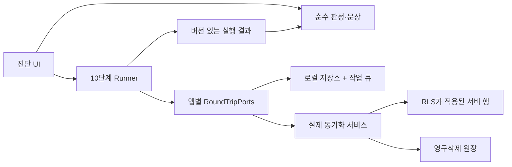

# 운영 쓰기 왕복검사 이식 설계서

> 문서 버전: 1.0
>
> 기준 구현: Bugeon Journey v1.92의 10단계 「왕복 시험」
>
> 기준일: 2026-08-07
>
> 목적: 다른 오프라인 우선·클라우드 동기화 앱에서 같은 질문과 증거 수준을 재현한다.

## 1. 한 문장 계약

> **지금 이 기기에서 시험용 기록 하나를 실제 사용자 경로로 저장한 뒤, 서버 전송·서버 되읽기·수정 시각 수렴·휴지통 삭제·영구삭제·좀비 차단 원장·로컬 정리까지 권위 있는 상태로 확인한다.**

이 검사는 코드가 “그럴듯하게 연결됐는가”가 아니라 **운영 경로가 지금 실제로 왕복하는가**를 묻는 쓰기 진단이다. HTTP 성공, 빈 동기화 큐, 사라진 임시 상태만으로는 통과시키지 않는다.

이 문서의 `MUST`, `SHOULD`, `MAY`는 각각 필수, 강한 권장, 선택을 뜻한다.

## 2. 무엇을 증명하고 무엇을 증명하지 않는가

### 증명하는 것

- 로컬 저장 함수가 실제로 내구성 커밋을 만든다.
- 일반 사용자가 쓰는 동기화 경로가 큐에만 머물지 않고 서버까지 간다.
- 서버가 해당 ID의 활성 행을 실제로 돌려준다.
- INSERT뿐 아니라 UPDATE 경로도 작동한다.
- 서버가 `updated_at`을 다시 써도 로컬과 서버가 같은 순간으로 수렴한다.
- soft delete가 서버 tombstone으로 전파된다.
- permanent delete 뒤 서버 행이 없어지고, 부활 방지 원장에는 ID가 남는다.
- 시험용 엔티티가 로컬에 남지 않으며, 남았다면 숨기지 않고 보고한다.

### 별도 검사로 남기는 것

- 사진·소리 같은 외부 바이트 저장소의 PUT/GET/DELETE와 바이트 무결성
- 부모 삭제의 전체 cascade와 자식별 복원 대칭
- 두 기기의 동시 수정, canonical snapshot, 충돌 해결
- 대량 페이지 경계, 백업·복원, 네트워크 장기 단절
- 로그인 없는 접근 차단과 전체 RLS 공격 표면

이 항목들을 한 판에 모두 넣으면 실패 시 정리 경계가 커지고 “어디서 끊겼는가”가 흐려진다. 각각을 형제 진단으로 둔다.

## 3. 비타협 안전 경계

1. **정상 사용자 세션과 정상 앱 API만 사용한다.** `service_role`, 관리자 JWT, RLS 우회 연결은 금지한다.
2. **검사가 생성한 정확한 ID만 변경한다.** 사용자 엔티티를 샘플로 골라 수정하거나 삭제하지 않는다.
3. 생성물은 무작위 `fixtureId`와 `runId`를 갖고, 가능하면 서버 필드나 메타데이터에 `diagnostic_owner=roundtrip`을 기록한다.
4. 제목 접두사는 사람이 알아보는 보조 표식일 뿐, 삭제 권한의 근거가 되어서는 안 된다.
5. 기본 fixture에는 외부 파일과 cascade 자식을 붙이지 않는다.
6. 모든 단계에 제한시간을 둔다. 제한시간 초과는 실패 또는 확인 불가로 기록하고 무한 대기하지 않는다.
7. 본 실행은 사용자·기기당 한 번만 허용하는 mutex를 둔다. 중복 실행은 새 판을 시작하지 않고 진행 중 상태를 보여준다.
8. 실패 여부와 무관하게 `finally`에서 정확한 `fixtureId`의 보상 정리를 시도한다.
9. 정리 실패는 숨기지 않는다. 로컬 행, 서버 행, 의도하지 않은 큐 작업을 각각 되읽고 ID와 조치 방법을 남긴다.
10. 영구삭제 원장 표식은 좀비 차단을 위한 **의도적 잔존 증거**다. 일반 잔재와 구분해 수명 정책을 명시한다.
11. 첫 쓰기 **직전** `activeRun` journal에 계정·기기·`runId`·`fixtureId`를 내구성 저장한다. 탭·앱이 종료돼 `finally`가 못 돌아도 다음 시작이 정확한 ID 하나만 복구한다. 행이 생기기 전 종료됐으면 “없음”을 확인하고 journal만 지우면 된다.
12. 전체 동기화 진입점은 다른 사용자 대기 작업도 함께 처리할 수 있음을 전제로 한다. 왕복검사의 성공은 전체 sync 성공이 아니라 **이번 fixture operation의 착지 영수증과 되읽기**로 판정한다.

### 인증·RLS 경계

- 서버의 `ownerId`는 클라이언트 입력을 신뢰하지 않고 인증 주체에서 결정해야 한다.
- 정상 `authenticated` 역할은 자기 fixture에 SELECT/INSERT/UPDATE/DELETE가 가능해야 한다.
- 두 번째 사용자로 같은 ID를 조회·수정·삭제할 때는 전부 차단돼야 한다.
- RLS policy뿐 아니라 Data API의 명시적 table/function `GRANT`도 검사한다.
- INSERT/UPDATE에는 자기 소유권을 강제하는 `WITH CHECK`가 있어야 한다.
- purge ledger는 필요한 SELECT/INSERT만 허용하고, 일반 사용자의 임의 UPDATE/DELETE는 막는다.

## 4. 전체 구조



구조는 네 층으로 나눈다.

1. **단계 등록부·판정 순수층**: 단계 순서, 라벨, 증명 문장, 결과 등급을 한 곳에서 정의한다.
2. **Runner**: 선행 관계, 제한시간, 실패 기록, `finally` 정리를 담당한다.
3. **앱별 포트**: 실제 로컬 저장·동기화·서버 조회·삭제 함수를 연결한다.
4. **표시층**: 마지막 결과를 읽어 판정과 증거를 표시하고 실행 버튼을 제공한다.

Runner가 서버 테이블을 직접 쓰면 안 된다. 그래야 사용자가 누르는 실제 저장·수정·삭제 경로를 검사한다. 반대로 **서버 되읽기**는 동기화 캐시가 아니라 서버 권위 상태를 직접 조회해야 한다.

## 5. 10단계 정본

순서는 계약이다. 선행 단계가 실패하면 그 단계에 의존하는 뒤 단계는 `skipped`로 기록한다. 단, 보상 정리는 본 흐름과 별도로 항상 시도한다.

| # | ID | 실행 | 통과 조건 | 증명하는 것 |
|---:|---|---|---|---|
| 1 | `create` | 실제 local-first 생성 함수로 fixture 저장 | 로컬에서 정확한 ID를 되읽을 수 있고, 앱 계약상 entity+operation 내구성 커밋이 완료됨 | 오프라인에서도 기록이 먼저 남는다 |
| 2 | `push` | 일반 동기화 진입점 실행 | 동기화 호출이 오류 없이 한 세대를 마침 | 보낼 것이 큐에만 앉아 있지 않는다 |
| 3 | `serverRead` | 서버에서 `owner + fixtureId` 정확 조회 | 활성 행 1건, `deleted_at = null` | 성공 응답이 아니라 실제 행이 서버에 있다 |
| 4 | `update` | 실제 수정 함수로 식별 가능한 필드 변경 | 로컬 행이 새 값이며 새 `updated_at`을 가짐 | INSERT뿐 아니라 UPDATE 경로도 간다 |
| 5 | `stampRead` | 다시 동기화하고 서버·로컬 되읽기 | 서버 값이 수정값이며 두 `updated_at`이 같은 순간 | 서버 트리거 뒤에도 LWW 기준이 수렴한다 |
| 6 | `delete` | 실제 soft-delete 함수 실행 | 로컬 tombstone이 원자적으로 저장됨 | 삭제가 되돌릴 수 있는 형태로 남는다 |
| 7 | `tombstoneRead` | 동기화 후 서버 정확 조회 | 행이 존재하고 `deleted_at != null` | 다른 기기도 삭제를 볼 수 있다 |
| 8 | `purge` | 실제 영구삭제 함수 실행 | 앱의 2단계 purge 요청이 생성됨 | 영구삭제 경로가 실제로 시작된다 |
| 9 | `purgeRead` | 동기화 후 서버 행과 원장 조회 | 서버 행은 없고, 원장에는 정확한 ID가 있음 | 서버 부재와 좀비 차단을 함께 증명한다 |
| 10 | `cleanup` | 보상 정리 후 로컬·서버·큐 되읽기 | 로컬/서버 엔티티와 의도하지 않은 작업이 없고, 허용된 원장 표식만 남음 | 검사가 자기 오염을 숨기지 않는다 |

`push`, `delete`, `purge` 같은 **행동 단계의 성공만으로는 충분하지 않다.** 각각 뒤의 권위 있는 되읽기 단계가 완료 증거다.

## 6. 이식 포트

다른 앱은 다음 의미를 만족하는 어댑터를 구현한다. 함수명은 바꿔도 되지만 의미를 약화하면 호환 왕복검사가 아니다.

```ts
type Instant = string; // 비교 시 문자열이 아니라 epoch/Temporal 등 의미 단위로 정규화

interface FixtureRef {
  runId: string;
  fixtureId: string;
  ownerId: string;
}

interface LocalFixture {
  id: string;
  value: string;
  updatedAt: Instant;
  deletedAt: Instant | null;
}

interface ServerFixture {
  id: string;
  value: string;
  updatedAt: Instant;
  deletedAt: Instant | null;
}

interface CleanupEvidence {
  localEntityPresent: boolean;
  serverEntityPresent: boolean | null; // 조회 불가면 null, false로 반올림 금지
  pendingOperations: string[];
  purgeMarkerPresent: boolean | null;
  unexpectedResidues: string[];
}

interface SyncReceipt {
  /** 이번 요청이 관측한 canonical 세대. 세대 개념이 없는 앱은 고정값을 쓴다. */
  generation: string;
  /** 서버 read-back까지 끝난 operation. */
  landedOperationIds: string[];
  failedOperationIds: Array<{ id: string; reason: string }>;
  completedAt: string;
}

interface RunLease {
  runId: string;
  ownerDeviceId: string;
  expiresAt: string;
  release(): Promise<void>;
}

type MutationKind = 'create' | 'update' | 'delete' | 'purge';

interface RoundTripPorts {
  preflight(): Promise<{
    authenticated: boolean;
    backendConfigured: boolean;
    writable: boolean | null;
    reason: string | null;
  }>;

  acquireRunLock(runId: string): Promise<RunLease>;
  readCanonicalGeneration(): Promise<string>;
  writeActiveRun(ref: FixtureRef): Promise<void>;
  clearActiveRun(ref: FixtureRef): Promise<void>;
  recoverActiveRun(): Promise<FixtureRef | null>;

  createFixture(ref: FixtureRef, value: string, signal: AbortSignal): Promise<LocalFixture>;
  updateFixture(ref: FixtureRef, value: string, signal: AbortSignal): Promise<LocalFixture>;
  softDeleteFixture(ref: FixtureRef, signal: AbortSignal): Promise<void>;
  purgeFixture(ref: FixtureRef, signal: AbortSignal): Promise<void>;
  /** mutation 직후, sync로 사라지기 전에 이번 fixture의 operation ID를 정확히 돌려준다. */
  targetOperationIds(ref: FixtureRef, mutation: MutationKind): Promise<string[]>;

  sync(reason: string, targetOperationIds: string[], signal: AbortSignal): Promise<SyncReceipt>;
  readLocal(ref: FixtureRef): Promise<LocalFixture | null>;
  readServer(ref: FixtureRef): Promise<ServerFixture | null>;
  readPurgeMarker(ref: FixtureRef): Promise<boolean>;

  compensate(ref: FixtureRef): Promise<void>;
  readCleanupEvidence(ref: FixtureRef): Promise<CleanupEvidence>;
}
```

### 포트 연결 규칙

- `createFixture`, `updateFixture`, `softDeleteFixture`, `purgeFixture`는 운영 앱이 쓰는 **같은 도메인 서비스**를 호출해야 한다.
- `sync`는 단순 예약 함수라면 안 된다. 이번 fixture의 operation ID가 `landedOperationIds` 또는 `failedOperationIds`에 나타날 때까지 기다리고, 서버 read-back까지 끝난 영수증을 반환해야 한다.
- `readServer`와 `readPurgeMarker`는 로컬 캐시를 통과하지 않는 서버 조회여야 한다.
- 모든 서버 조회는 정상 사용자의 인증과 RLS 범위에서 `owner + id`로 제한한다.
- `readCleanupEvidence`의 일부 조회가 실패하면 `null/unknown`으로 남긴다. 부재로 간주하지 않는다.
- 제한시간이 지나면 `AbortController.abort()`만 호출하고 끝내지 않는다. 포트가 취소를 확인해 뒤늦은 쓰기가 착지하지 않음을 되읽어야 한다.
- canonical generation을 쓰는 앱은 실행 전후 세대가 같아야 한다. 중간에 바뀌면 서로 다른 세계의 증거를 합치지 않고 `unknown`으로 끝내며 추가 push를 금지한다.
- lock은 `runId` 소유, 기기·계정 범위, lease 만료와 비정상 종료 뒤 회수 규칙을 가져야 한다.

## 7. 결과 데이터 계약

마지막 결과는 사용자 기억 데이터베이스가 아닌 진단 캐시에 저장한다. 스키마 버전을 반드시 두고, 단계 목록이 현재 등록부와 다르면 낡은 결과를 `unknown`으로 취급한다.

```ts
type StepId =
  | 'create'
  | 'push'
  | 'serverRead'
  | 'update'
  | 'stampRead'
  | 'delete'
  | 'tombstoneRead'
  | 'purge'
  | 'purgeRead'
  | 'cleanup';

type StepState = 'pass' | 'fail' | 'skipped' | 'unknown';

interface StepResult {
  step: StepId;
  state: StepState;
  startedAt: string | null;
  ms: number | null;
  errorCode: string | null;
  error: string | null;
  note: string | null;
}

interface RoundTripRun {
  schemaVersion: 1;
  appVersion: string;
  protocolVersion: string;
  accountKey: string;
  surfaceId: string;
  runId: string;
  fixtureId: string | null;
  ownerId: string | null;
  deviceId: string;
  startedAt: string;
  finishedAt: string;
  generationBefore: string;
  generationAfter: string | null;
  preflight: 'pass' | 'blocked' | 'unknown';
  steps: StepResult[];
  cleanup: CleanupEvidence | null;
}
```

진단 캐시에 토큰, 전체 서버 응답, 사용자 본문, 위치, 파일 경로를 저장하지 않는다. 오류는 사용자에게 필요한 범위로 정제하되 원인을 삼키지 않는다.

## 8. Runner 알고리즘

```ts
async function runRoundTrip(ports: RoundTripPorts): Promise<RoundTripRun> {
  const ref = makeRandomFixtureRef();
  const lease = await ports.acquireRunLock(ref.runId);
  const results: StepResult[] = [];
  const generationBefore = await ports.readCanonicalGeneration();

  try {
    const preflight = await withTimeout(ports.preflight(), PREFLIGHT_TIMEOUT);
    if (!preflight.authenticated || !preflight.backendConfigured || preflight.writable === false) {
      return blockedRun(ref, preflight.reason); // 문제라고 추측하지 않고 확인 불가
    }

    await step('create', async (signal) => {
      await ports.writeActiveRun(ref);
      return ports.createFixture(ref, initialValue(ref), signal);
    });
    await dependentStep('push', ['create'], async (signal) => {
      const opIds = await ports.targetOperationIds(ref, 'create');
      assert(opIds.length > 0);
      assertLanded(await ports.sync('round-trip create', opIds, signal), opIds);
    });
    await dependentStep('serverRead', ['push'], async () => {
      const row = await ports.readServer(ref);
      assert(row && row.deletedAt === null && row.value === initialValue(ref));
    });

    await dependentStep('update', ['serverRead'], (signal) => ports.updateFixture(ref, updatedValue(ref), signal));
    await dependentStep('stampRead', ['update'], async (signal) => {
      const opIds = await ports.targetOperationIds(ref, 'update');
      assert(opIds.length > 0);
      assertLanded(await ports.sync('round-trip update', opIds, signal), opIds);
      const [local, server] = await Promise.all([ports.readLocal(ref), ports.readServer(ref)]);
      assert(local && server && server.value === updatedValue(ref));
      assert(compareInstant(local.updatedAt, server.updatedAt) === 0);
    });

    await dependentStep('delete', ['stampRead'], (signal) => ports.softDeleteFixture(ref, signal));
    await dependentStep('tombstoneRead', ['delete'], async (signal) => {
      const opIds = await ports.targetOperationIds(ref, 'delete');
      assert(opIds.length > 0);
      assertLanded(await ports.sync('round-trip soft delete', opIds, signal), opIds);
      const row = await ports.readServer(ref);
      assert(row && row.deletedAt !== null);
    });

    await dependentStep('purge', ['tombstoneRead'], (signal) => ports.purgeFixture(ref, signal));
    await dependentStep('purgeRead', ['purge'], async (signal) => {
      const opIds = await ports.targetOperationIds(ref, 'purge');
      assert(opIds.length > 0);
      assertLanded(await ports.sync('round-trip permanent delete', opIds, signal), opIds);
      assert((await ports.readServer(ref)) === null);
      assert(await ports.readPurgeMarker(ref));
    });

    assert((await ports.readCanonicalGeneration()) === generationBefore);
  } finally {
    await recordCleanupStep(async () => {
      await ports.compensate(ref);
      const e = await ports.readCleanupEvidence(ref);
      assertCleanup(e);
      await ports.clearActiveRun(ref);
    });
    await lease.release();
  }

  return buildVersionedRun(ref, results);
}
```

구현 시 주의점은 다음과 같다.

- `dependentStep`은 선행 단계가 모두 `pass`일 때만 실행한다. 아니면 `skipped`다.
- `cleanup`은 선행 실패와 무관한 **보상 단계**다. 결과 배열에서는 항상 마지막 한 칸을 차지한다.
- 정리 중 원래 실패를 덮어쓰지 않는다. 판정은 첫 본시험 실패를 먼저 보여주고 잔재를 함께 알린다.
- 예외를 최상위 밖으로 던져 실행 위치를 잃지 않는다. 오류는 단계 결과로 바꾸되, 취소·탭 종료를 위한 `AbortSignal`은 존중한다.
- 성공 시 사라지는 큐·락의 부재를 성공 증거로 쓰지 않는다. 서버 행·tombstone·원장·로컬 행을 되읽는다.
- 앱 시작 시 `recoverActiveRun()`이 값을 돌려주면 새 시험보다 정확한 ID의 보상 정리를 먼저 제안하거나 실행한다. 접두사 검색으로 대상을 넓히지 않는다.

## 9. 시각 수렴 계약

`updated_at`은 문자열로 비교하지 않는다. `2026-08-07T00:00:00.000Z`와 `2026-08-07T00:00:00+00:00`는 같은 순간이다.

1. 수정 직후 로컬이 보낸 시각을 관측값으로 저장한다.
2. UPDATE 동기화 뒤 서버 행과 로컬 행을 다시 읽는다.
3. 두 현재 시각을 의미 단위로 비교한다. 비교 불가면 실패다.
4. 서버가 시각을 바꾼 것 자체는 실패가 아니다. 로컬이 서버 read-back을 받아 같은 순간으로 수렴하면 통과다.
5. 서버가 바꿨는지는 성공 단계의 `note`에 남길 수 있다.

## 10. 영구삭제 원장과 잔재 정책

`purgeRead`의 정상은 다음 두 조건의 교집합이다.

```text
서버 엔티티 없음 AND purge marker 있음
```

행 부재만 보면 “원래 없었음”, “조회 실패”, “삭제 성공”을 구분할 수 없다. 원장만 보면 실제 행이 남은 부분 실패를 놓친다.

원장 표식은 좀비 부활을 막기 위해 보존될 수 있으므로 다음 중 하나를 프로젝트 프로필에 선택한다.

- **권장**: 운영과 같은 RLS·트리거를 쓰는 진단 전용 tenant/namespace에 fixture와 원장을 격리하고 보존 기간을 둔다.
- 운영 테이블을 써야 하면 무작위 fixture ID를 사용하고, 원장에 진단 출처를 표시할 수 있게 한다.
- 원장 출처 표시가 불가능하면 해당 표식은 “의도적 잔존”으로 문서화하고 증가량을 모니터링한다.
- 원장을 임의로 지워 깨끗해 보이게 만들지 않는다. 삭제하면 좀비 차단을 검사했다는 증거와 안전장치가 함께 사라진다.

## 11. 판정 규칙

| 조건 | 판정 | 사용자 문장 원칙 |
|---|---|---|
| 실행한 적 없음, 캐시 형식이 낡음 | `unknown` | “아직 확인하지 않음” |
| 서버 미설정, 로그아웃, 권한 판정 불가 | `unknown` | 실행하지 못한 사유를 말함 |
| 본시험 단계가 하나라도 실패 | `problem` | **첫 실패 단계**, 그 단계가 증명하려던 것, 실제 오류를 말함 |
| 본시험은 통과했으나 정리 잔재 있음 | `todo` | 잔재 위치·ID·안전한 정리 방법을 말함 |
| 10단계 모두 통과하고 허용되지 않은 잔재 없음 | `ok` | 확인된 큰 단계와 `10/10`을 말함 |

`skipped`와 `unknown`은 `pass` 수에 포함하지 않는다. 기대값은 항상 `10/10 단계 통과 · 허용되지 않은 잔재 없음`처럼 명시한다.

마지막 성공 결과에는 실행 시각과 앱 버전·프로토콜 버전을 함께 표시한다. 오래된 초록은 현재 상태의 증거가 아니다.

## 12. 실패 주입 매트릭스

아래 실패를 하나씩 주입해 **게이트가 RED가 되는 것**을 확인해야 한다.

| 주입 | 반드시 나타나야 할 결과 |
|---|---|
| 로컬 entity만 저장되고 operation이 빠짐 | `create` 또는 원자성 계약 검사 실패 |
| 동기화가 200을 반환하지만 서버 행 없음 | `serverRead` 실패 |
| sync가 내부 실패 상태를 기록하고 정상 resolve | 목표 operation 영수증 부재로 `push` 실패 |
| 서버 행이 이미 tombstone | `serverRead` 실패 |
| UPDATE가 INSERT와 다른 권한/트리거에서 거절됨 | `update` 또는 `stampRead` 실패 |
| 서버가 시각을 바꿨는데 로컬이 read-back하지 않음 | `stampRead` 실패 |
| UPDATE 본문은 서버에 안 갔지만 시각만 같음 | 수정값 대조로 `stampRead` 실패 |
| soft delete 뒤 서버 행이 활성 상태 | `tombstoneRead` 실패 |
| soft delete가 행을 바로 지워버림 | `tombstoneRead` 실패 |
| purge 뒤 서버 행이 남음 | `purgeRead` 실패 |
| 서버 행은 없지만 원장 표식이 없음 | `purgeRead` 실패 |
| 서버 조회 자체가 실패 | 부재로 반올림하지 않고 해당 read 단계 실패/unknown |
| 본시험 실패 뒤 보상 정리도 실패 | 첫 본시험 실패 우선 + 잔재 별도 보고 |
| 이전 단계 실패 뒤 다음 포트가 호출됨 | 호출 금지 단언 실패 |
| 오래된 8단계 캐시를 주입 | `unknown`, 통과 금지 |
| 두 번 동시에 실행 | 두 번째 실행 차단, fixture 1개만 생성 |
| 사용자 제목이 진단 접두사와 같음 | 그 사용자 기록은 절대 정리 대상이 아님 |
| create 직후 탭 종료·재시작 | journal의 정확한 fixture만 복구 |
| timeout 뒤 취소되지 않은 쓰기가 늦게 착지 | 취소 완료·잔재 read-back 실패로 RED |
| 실행 중 canonical generation 변경 | 전체 판정 `unknown`, 추가 push 없음 |
| 다른 계정의 마지막 성공 캐시 | `unknown`, 이전 초록 표시 금지 |
| 서버/로컬/큐 중 한 층에만 fixture 잔재 | 해당 층과 ID를 분리 보고 |
| 두 번째 사용자의 fixture 접근 | SELECT/UPDATE/DELETE/ledger 접근 모두 차단 |

## 13. 자동검사와 라이브 검증

### 순수 유닛

- 10단계 순서가 고정돼 있다.
- 모든 단계에 라벨·증명 문장·상위 판정 이름이 있다.
- 첫 실패를 정확히 가리키고 뒤 단계는 `skipped`다.
- `unknown`, `problem`, `todo`, `ok` 네 갈래 모두 actual/expected가 있다.
- 성공 문장은 단계 등록부에서 생성돼 단계 수와 어긋나지 않는다.
- 오류·관측 문자열이 화면 렌더 방식과 맞는다.

### Runner 유닛

- fake ports로 10단계 호출 순서와 인자를 잠근다.
- 각 단계 실패를 하나씩 주입해 후속 호출 금지와 `finally` 정리를 검증한다.
- 시간 초과, 취소, lock 중복, 정리 실패를 검증한다.
- create 직후 강제 종료를 흉내 내고 journal 기반 재시작 복구를 검증한다.
- 목표 operation 실패를 숨긴 sync와 실행 중 canonical 세대 변경을 검증한다.
- 결과 캐시 버전과 단계 목록 검증을 잠근다.

### 앱 어댑터 통합검사

- 실제 운영 도메인 함수를 mock 서버와 연결해 entity+operation 원자성을 본다.
- 실제 row mapper로 timestamp/tombstone/null 경계를 왕복한다.
- purge가 행 삭제보다 원장을 먼저 또는 같은 원자 경계에서 확정하는지 본다.
- 서버 write 응답 뒤 read-back이 완료돼야 로컬 op가 끝나는지 본다.
- own-row 긍정 경로와 other-user SELECT/UPDATE/DELETE 차단, `WITH CHECK`, 명시적 GRANT를 함께 본다.

### 운영 라이브검사

- 로그인된 일반 사용자로 버튼을 직접 눌러 실행한다.
- 실제 서버에서 `owner + fixtureId` 행과 원장을 되읽는다.
- UI가 `10/10`, 단계별 시간·관측, 실행 시각을 표시하는지 본다.
- 실패 fixture가 사용자 목록에서 식별 가능하고 정리 액션이 작동하는지 본다.
- 파괴적 버튼을 자동 클릭할 수 없는 환경이면 그 사실을 `미실행`으로 분리 보고한다.

## 14. 앱별 이식 프로필

다른 앱은 이 문서를 복사해 수정하지 말고, 아래 값만 프로젝트별 프로필로 둔다.

```yaml
round_trip_profile_version: 1
entity:
  domain: <예: note>
  local_store: <예: Dexie.notes>
  server_table: <예: notes>
  purge_ledger: <예: purged_ids>
  owner_column: <예: user_id>
  id_column: id
  updated_at_column: updated_at
  deleted_at_column: deleted_at
fixture:
  visible_prefix: "[진단] 왕복 시험"
  machine_marker: <필드 또는 metadata 경로>
  cascade_children: none
ports:
  create: <운영 함수>
  update: <운영 함수>
  soft_delete: <운영 함수>
  purge: <운영 함수>
  sync: <운영 함수>
  server_read: <RLS 적용 exact-id 조회>
  ledger_read: <RLS 적용 exact-id 조회>
timeouts_ms:
  step: 30000
  whole_run: 180000
retention:
  purge_marker: <영구 또는 기간>
gates:
  narrow: <명령>
  unit: <명령>
  integration: <명령>
  live: <명령>
deployment_surfaces:
  - <웹/PWA/APK/서버 함수 등>
```

프로필에는 비밀값을 넣지 않는다. 해당 앱에 purge ledger가 없다면 `purgeRead`를 조용히 생략하지 말고 **비호환 차이**로 기록한 뒤, 동등한 좀비 차단 증거를 먼저 설계한다.

## 15. 도입 순서와 완료 조건

1. 검사할 최소 엔티티와 실제 운영 CRUD·동기화 함수를 식별한다.
2. 서버 RLS와 exact-id read-back 경로를 확인한다.
3. purge ledger 또는 동등한 좀비 차단 증거를 확인한다.
4. 앱별 프로필과 포트 어댑터를 작성한다.
5. 순수 판정과 Runner를 구현한다.
6. 실패 주입 매트릭스에서 각 제거·변조가 실제 RED인지 확인한다.
7. 로그인된 비관리자 계정으로 운영 왕복을 한 번 실행한다.
8. 서버 행 부재 + 원장 존재 + 로컬 부재를 다시 읽는다.
9. UI를 열어 판정 문장, `10/10`, 단계별 증거, 잔재 액션을 확인한다.
10. 각 배포 표면에서 같은 앱 버전·프로토콜 버전이 이 검사를 제공하는지 되읽는다.

완료는 “테스트 코드를 작성했다”가 아니라 **실제 서버 왕복과 정리 read-back까지 통과한 상태**다.

## 16. Bugeon Journey 기준 파일 지도

| 역할 | 기준 파일 |
|---|---|
| 10단계·라벨·증명·판정 정본 | `src/domain/roundTripVerdict.ts` |
| 실제 local-first·sync·server read-back 실행 | `src/services/roundTrip.ts` |
| 진단 UI·실행 액션·단계별 증거 | `src/ui/panels/diagnostics.ts` |
| 판정·문장·단계 등록부 유닛 | `tests/unit/roundTripVerdict.test.ts` |
| 동기화·영구삭제 계약 | `docs/SYNC_PROTOCOL.md`, `src/services/sync.ts`, `src/services/purge.ts` |

## 17. 현행 구현을 다른 앱에 복제하기 전에 보강할 점

이 절은 추측이 아니라 위 기준 파일을 대조해 확인한 차이다. **10단계가 묻는 질문은 그대로 유지하되 아래 구현 형태는 복사하지 않는다.**

1. `roundTripVerdict.ts`는 “앞이 실패하면 뒤는 돌지 않는다”고 정의하지만, 현행 Runner는 `create` 실패 외에는 뒤 단계를 계속 실행한다. 이식 Runner는 선행 의존 `skipped`를 실제 호출 수준에서 강제해야 한다.
2. 사전 조건 주석은 “못 도는 상황은 실패가 아니다”라고 하지만 현행 결과는 `create: fail`로 저장한다. 이식본은 별도 preflight `unknown/blocked`로 분리한다.
3. 현행 정리는 진단 접두사로 시작하는 **모든 로컬 여행**을 훑는다. 이식본은 접두사가 아니라 이번 실행의 `fixtureId + runId + machine marker`만 정리한다.
4. 현행 마지막 결과 캐시는 배열과 시각만 확인하므로 옛 8단계 결과도 읽힐 수 있다. 이식본은 `schemaVersion`과 정확한 단계 목록을 검증한다.
5. 현행 `leftover`는 서버 또는 로컬 잔재를 뜻한다고 적혀 있지만 자동 정리 결과는 주로 로컬 행을 확인한다. 이식본은 로컬·서버·큐·원장을 분리해 되읽는다.
6. 현행 유닛은 판정 순수층을 잘 잠그지만 Runner의 포트 호출 순서와 단계별 실패 주입은 직접 잠그지 않는다. 이식본에는 Runner 유닛을 필수로 둔다.
7. purge marker는 `purgeRead`의 필수 증거이면서 정상적으로 남는 데이터다. 이식 앱은 이를 일반 잔재와 구분하고 격리·표시·보존 정책을 정해야 한다.
8. 현행 서버 되읽기는 주로 `deleted_at`과 `updated_at`을 보므로 수정된 본문과 목표 operation/version 착지를 직접 증명하지 않는다. 이식본은 수정값과 operation 영수증을 함께 대조한다.
9. 현행 `requestSync()`는 전체 동기화 진입점이라 다른 대기 작업과 pull도 함께 처리할 수 있고, 내부 실패를 상태에 기록한 뒤 resolve할 수 있다. 이식본은 부작용 범위를 밝히고 이번 fixture operation의 결과만 영수증으로 판정한다.
10. 현행에는 mutex·단계 timeout·`activeRun` journal이 없다. 이식본은 동시 실행과 비정상 종료 뒤 정확한 복구를 계약으로 둔다.
11. 현행 캐시는 계정·앱·프로토콜·배포 표면을 구분하지 않는다. 이식본은 현재 계정과 버전이 다르면 옛 초록을 `unknown`으로 내린다.
12. 현행 UTC 실행 시각은 시간대 표기 없이 잘라 보일 수 있다. 이식본은 ISO offset 또는 사용자의 현지 시간대 이름을 함께 표시한다.
13. 현행의 `allPass + leftover → todo` 판정 유닛은 있지만 Runner는 잔재가 생기면 `cleanup`도 실패로 기록해 그 갈래가 도달하기 어렵다. 이식본은 본시험 실패와 보상 정리 실패를 독립 축으로 저장한다.

이 보강점은 검사 범위를 넓히는 새 기능이 아니라, “자기가 만든 것만 건드리고 측정하지 않은 것을 통과라 하지 않는다”는 기존 안전 계약을 구현과 일치시키는 장치다.

## 18. 최소 인수 기준

- [ ] 일반 사용자 세션과 RLS 아래에서 실행된다.
- [ ] fixture는 기계 표식과 무작위 ID를 갖는다.
- [ ] 10단계 순서와 각 단계의 권위 있는 증거가 구현됐다.
- [ ] UPDATE 뒤 서버·로컬 시각을 의미 단위로 비교한다.
- [ ] tombstone 행 존재와 purge 뒤 행 부재+원장 존재를 각각 확인한다.
- [ ] 첫 실패 뒤 의존 단계는 실제로 호출되지 않고 `skipped`다.
- [ ] 어떤 실패에서도 `finally` 보상 정리를 시도한다.
- [ ] 첫 쓰기 직전 영속 journal을 남기고 성공한 정리 read-back 뒤에만 지운다.
- [ ] 목표 operation 착지를 `SyncReceipt`로 확인하고 전체 sync 성공과 구분한다.
- [ ] timeout이 실제 포트 취소와 늦은 쓰기 부재 확인으로 이어진다.
- [ ] canonical generation이 실행 중 바뀌면 증거를 섞지 않고 `unknown`이다.
- [ ] 사용자 데이터는 제목이 같아도 정리하지 않는다.
- [ ] 결과 캐시는 앱·프로토콜·계정·표면 버전이 있고 낡거나 다른 계정의 결과는 `unknown`이다.
- [ ] own-row 허용과 other-user 차단, `WITH CHECK`, GRANT를 검증했다.
- [ ] 실패 주입 매트릭스가 실제 RED임을 확인했다.
- [ ] 운영 서버에서 한 판을 실행해 10/10과 잔재 없음(허용된 원장 표식 제외)을 되읽었다.
- [ ] 화면에서 판정·기대값·실패 사유·실행 시각·정리 방법을 확인했다.
